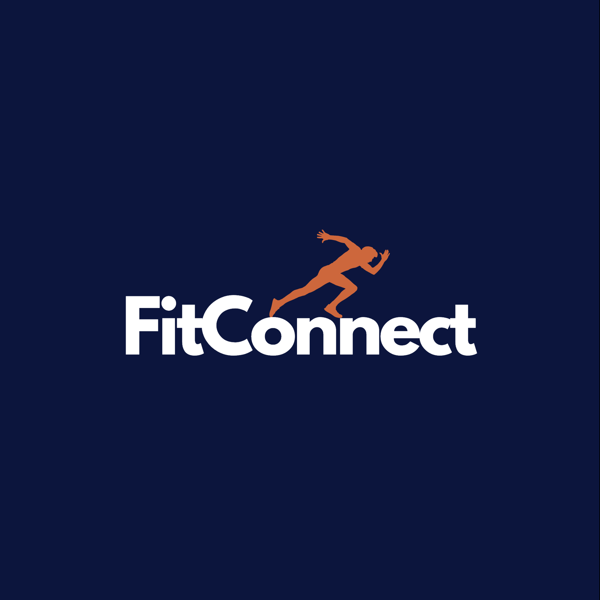

  

  

  <h1 align="center">FitConnect</h1>
  

    Get Connected, Get Active!
  

FitConnect is a solution to address the challenge of being unable to find individuals or groups with whom to engage in physical activity or play a particular sport, by providing a platform for students to connect with like-minded individuals, checking sports availability in a facility, offer specific tools at the sports center, and notifying them about relevant preferences. This app can help users overcome logistical and social barriers, foster a sense of community, and encourage ongoing engagement in physical activity, promoting improved physical and mental health.

## License

- **[MIT license](LICENSE)**
- Copyright 2023 © FitConnect
